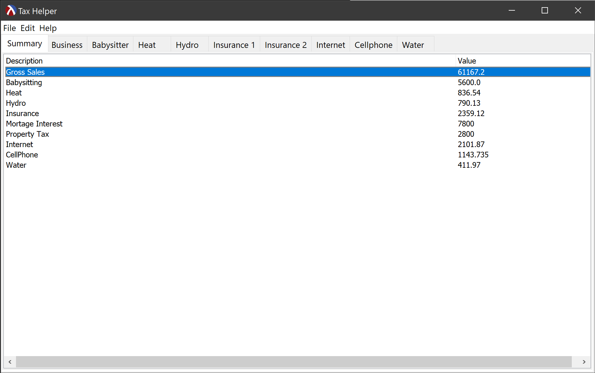
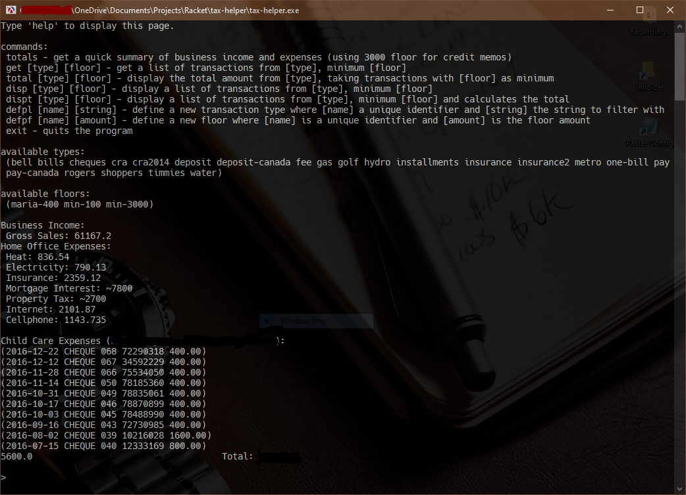

# Tax Helper
A simple accounting tool to compute totals for tax returns.

GUI version:

CLI version:

## Features

- support for importing transactions from a CSV file, compatible with most online banking Web sites;
- easy-to-use graphical user interface for quick totals and categorized transaction details;
- powerful, extendable command-line interface with inline help;
- support for custom transaction and filter definitions;
- automatic total generation per transaction category.

## Downloads
You can <b>download</b> the latest GUI and CLI releases for <b>Windows</b> 64 bits as a portable, standalone executable [HERE](https://github.com/DexterLagan/tax-helper/releases).

## Import Format
Here is the CSV format used by Tax Helper to import bank transactions:
<pre>
date, transaction name, debit amount, credit amount
</pre>

Fields do not need to be quoted, but there should be no punctuation or quotes in the transaction name.

## Command Line Commands Summary

These commands are available on the command-line version of Tax Helper. They give you total control on the way totals are calculated: one can define as many transaction types as desired, and one can also define floor amounts to help filtering transactions:
<pre>
totals - get a quick summary of business income and expenses (using 3000 floor for credit memos;
get [type] [floor] - get a list of transactions from [type], minimum [floor];
total [type] [floor] - display the total amount from [type], taking transactions with [floor] as minimum;
disp [type] [floor] - display a list of transactions from [type], minimum [floor];
dispt [type] [floor] - display a list of transactions from [type], minimum [floor] and calculates the total;
defpl [name] [string] - define a new transaction type where [name] a unique identifier and [string] the string to filter with;
defpf [name] [amount] - define a new floor where [name] is a unique identifier and [amount] is the floor amount;
exit - quits the program.
</pre>
    
## Sample Transaction Types

Let's define some common transaction predicates:
<pre>
(defpl pay "Branch Transaction CREDIT MEMO")
(defpl pay-canada "Electronic Funds Transfer PAY CANADA")
(defpl deposit "INTERNET DEPOSIT")
(defpl deposit-canada "DEPOSIT CANADA")
(defpl fee "TRANSACTION FEE")
(defpl insurance "Dominion of Canada Gen")
(defpl insurance2 "DOMINION OF CANADA GROUP")
(defpl timmies "TIM HORTONS")
(defpl shoppers "SHOPPER'S DRUG")
(defpl metro "METRO")
(defpl golf "VW CREDIT CAN")
(defpl bills "INTERNET BILL PAY")
(defpl bell "BELL CANADA")
(defpl one-bill "BELL CANADA - ONE BILL")
(defpl rogers "ROGERS")
(defpl hydro "HYDRO OTTAWA")
(defpl gas "ENBRIDGE")
(defpl water "OTTAWA WATER")
(defpl cra "CRA (REVENUE -")
(defpl cra2014 "CRA (REVENUE) - 2014")
(defpl installments "CRA (REVENUE) - TAX INSTA")
(defpl cheques "CHEQUE")
</pre>

## Sample Floor Amounts

Let's define some minimum amounts for filtering:
<pre>
(defpf min-100 100)
(defpf maria-400 400)
(defpf min-3000 3000)
</pre>

## How to extend Tax Helper:

To add a new tab / list:
1) launch MrEd UI editor, open the tax-helper-ui.med project
2) copy-paste the last tab+listbox
3) rename the new tab and listboxes appropriately
4) save the project and export to tax-helper-ui.rkt
5) update the load-and-compute procedure: 
  a) add a label and a total to the summary list 
  b) define a new column-data and populate it to the new list 

Notes:
- Column data has to be strings only
- You might need to switch rows and columns depending on the data source.

## License

Tax Helper is free software; see [LICENSE](https://github.com/DexterLagan/tax-helper/blob/main/LICENSE) for more details.
